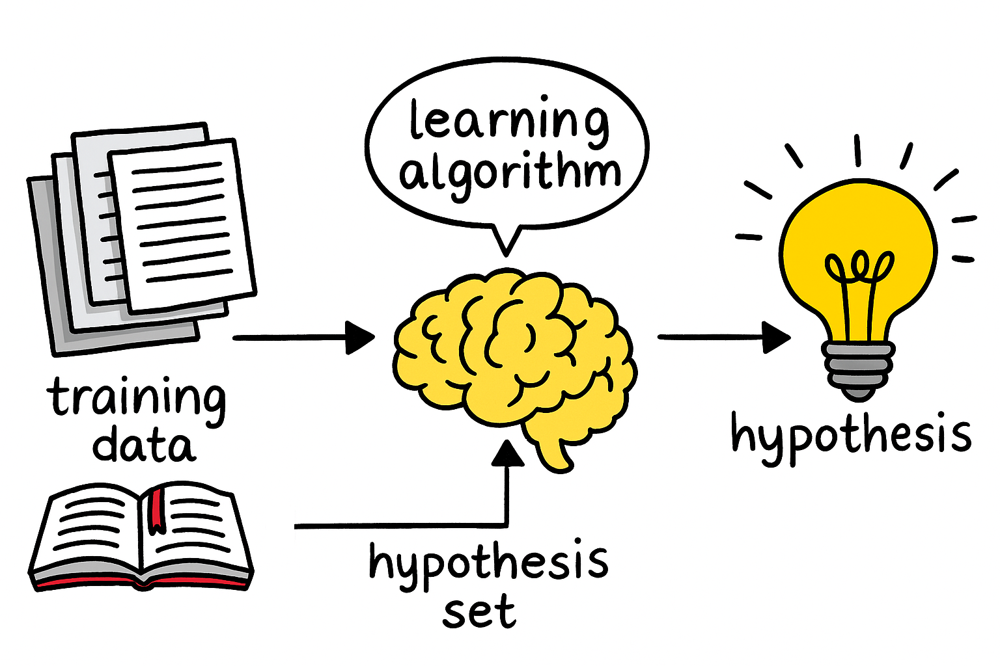
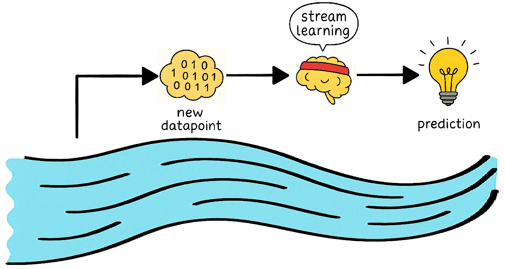
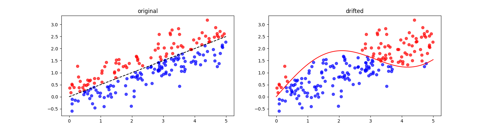
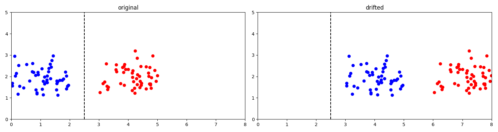
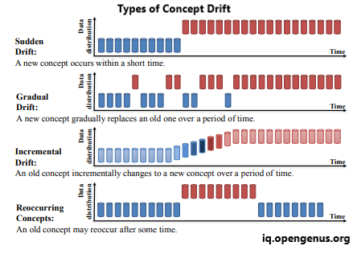
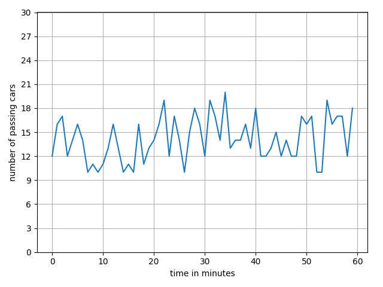
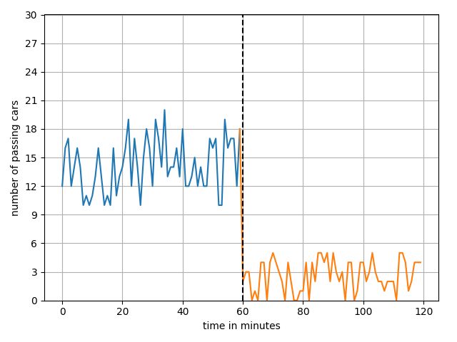
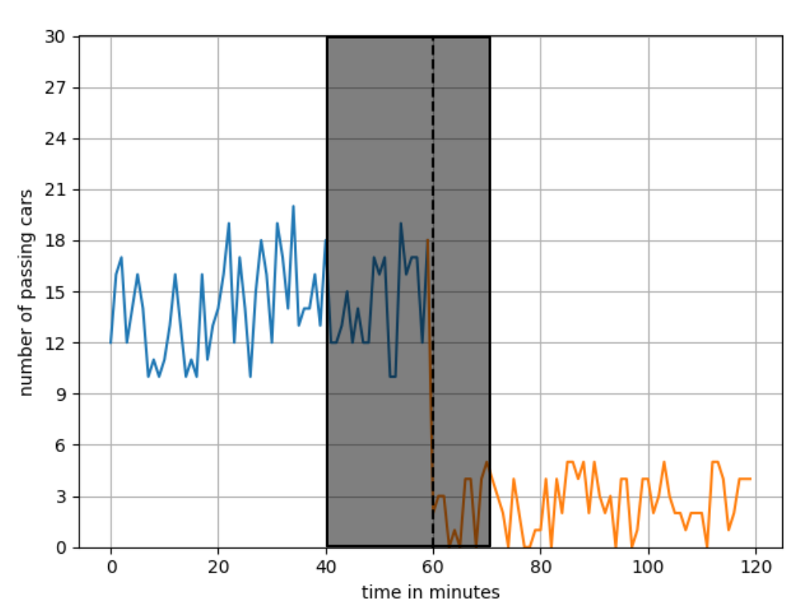

# Introduction 

In the field of machine learning, there are various methods for
addressing different topics and problem types in order to analyze them
appropriately and develop suitable models.

It is not always entirely clear when to use which method, what
distinguishes one from another, or in which situations each should be
applied.\
One of those methods is stream learning.\
In the following, I would like to explain what stream learning is, how
it differs from classical batch-based machine learning, and clarify
common misconceptions.

The focus will be particularly on stream learning and what fundamentally
characterizes it.

However, the goal is not to explain the mathematical concepts behind it,
but rather to make the concrete differences clear - when to use which
model and why it is important to choose the right tool for the problem
at hand.

# The boundaries of batch learning 

In machine learning it is generally assumed that a model is developed
and trained on a training dataset and then evaluated to determine
whether the resulting function corresponds to the given problem or
question.

This general approach is used in a wide range of fields (for example in
well-known LLMs) and has proven to be quite practical. However, there
are areas of application where a pre-trained model is not sufficient or
does not correctly solve the given problem.\
For instance, if rapid adaptation to changes is required or only very
limited memory is available, this approach reaches its limits. Even when
high precision is needed at all times while new data continuously
arrives, batch learning is not necessarily the best solution.\
This is exactly where *stream learning* comes in.

# What is stream learning?

Stream learning enables machine learning on continuous data streams without a predefined training dataset. 
In contrast to classical batch learning, the model adapts in real time with each new data point.

<figure style="text-align:center;">
  
  <figcaption>Simplified stream learning process for a new datapoint</figcaption>
</figure>

> The term stream learning obviously contains the word *stream*, which is
central to distinguishing it from classical machine learning.

A common question that arises when discussing stream learning is: \"What
is the training dataset?\"\
For now the short and unsatisfactory answer is: *There is none*. But
why?\
First, it is important to understand that we are not looking at the
model itself, which acts as a kind of intermediary between the dataset
and the output, providing results according to its function (e.g.,
classifying data), but rather at the problem itself.\
In other words, the focus is on the dataset itself, not the model.\
The data flows in continuously, for example as events or data points and
is processed almost in real time. This is essentially where the answer
to the earlier question about the training dataset lies.

No training is performed in the traditional sense; the data is processed
directly, and the corresponding results are produced. The model is
therefore continuously updated, rather than only being adjusted when it
becomes clear that it no longer provides reliable results for various
reasons.\
The key difference, therefore, lies in the learning approach and the way
the data is processed.

<figure id="fig:stream_and_batch" style="text-align:center;">
  
  
  <figcaption>Illustrations of stream learning (left) and batch learning (right)</figcaption>
</figure>

These (AI-generated) illustrations depict the basic principles of batch
learning and stream learning. The underlying algorithms have been highly
abstracted. The goal here is not mathematical precision, but rather to
provide a tangible illustration of the concrete differences.

In the left illustration, the data is shown as a continuous flow and is
processed directly by the algorithm. In the right illustration, an
observer examines a static dataset through a model, which is represented
here as a magnifying glass.

  <strong>stream learning in a nutshell</strong>

  Instead of examining a static dataset <em>through</em> a model, individual data points are processed directly <em>with</em> the model as a stream. The model adapts dynamically and immediately after processing each data point.

# concept drift 

From time to time the classification of data can change for various
reasons.

Let's take a look at a hypothetical example of an arbitrary intersection
in a city.

The model has distinguish between high and low traffic volume. It is
defined that an intersection should be evaluated differently at
different times (for example, rush hour versus nighttime) even if the
traffic volume is the same.

In other words, there are different rules that lead to different
outcomes for the same set of data. (real concept drift)
<figure style="text-align:center; margin: 1em auto;">
  
  <figcaption>Example for real concept drift</figcaption>
</figure>

Over time, however, the data itself can change, while the applied rules
remain unchanged. (virtual concept drift)

In our example, a newly opened bypass route could alter traffic at
certain intersections.
<figure style="text-align:center; margin: 1em auto;">

<figcaption>Example for virtual concept drift</figcaption>
</figure>

When a drift occurs, the model must be able to respond accordingly.\
For a batch model, this would mean that it now has to be completely
retrained and validated, which can be time- and cost-intensive. In
contrast, for stream-based learning, a new data point is simply taken
into account, and the parameters are adjusted accordingly.\
Considering the time component of the data, drift can generally be
divided into four different categories, as described in detail
[here](https://arxiv.org/abs/2004.05785).

# What does this look like in practice?

Let us first consider a simple example (If you want to experiment with real data yourself, 
you can find a dataset updated every minute for the city of Darmstadt (Germany) 
[here](https://opendata.darmstadt.de/dataset/verkehrsdaten-im-rohformat-2024)), which looks at traffic in a larger city.

Suppose we want to develop a machine learning model that, based on
traffic data (such as the utilization of certain roads, traffic density
at intersections, accidents, construction sites, etc.), can predict
whether traffic management should be adjusted or not, with the goal of
ensuring as smooth a traffic flow as possible. The predictions could,
for example, be used to adjust traffic light timings, provide
alternative routes, or send early warnings to traffic authorities.

## sudden drift

Let us illustrate this example using this classification to make the
principle clear:
<figure style="text-align:center; margin: 1em auto;">

<figcaption>Example traffic volume at an intersection in vehicles per minute</figcaption>
</figure>

In the classical approach, the model receives a training dataset created
from historical data, as shown in figure
[7](#fig:before_acc).

It is then trained and validated on this data and can make predictions
for the next few hours.

For this intersection, these predictions would typically range between
10 and 20 vehicles per minute.

Now, suppose an accident occurs at this intersection, causing traffic to
change rapidly and bringing it almost to a standstill, as shown in
figure [8](#fig:after_acc)
<figure style="text-align:center; margin: 1em auto;">

<figcaption>Example traffic volume in vehicles per minute, adjusted due to an accident</figcaption>
</figure>

> *How accurate will the prediction of the trained model be now?*

This admittedly very rapid change (*sudden drift*) cannot be correctly
predicted by the model, as this incident was not considered during
training. The model would therefore need to be retrained in order to
make accurate predictions again.\
This is time- and resource-intensive and not practical for rapidly
changing systems like in this example.

> *This is where stream learning, as described above, comes into play.*

Each new data point leads to a direct adaptation of the model, allowing
it to respond quickly to the dynamic changes in the data.

In our example, traffic can thus be redirected through early
notifications to drivers or authorities, or necessary measures can be
taken quickly and automatically.

## Gradual drift 

Due to demographic changes in the city, traffic rush hours shift over
time. A residential area with typical commuter traffic gradually
transforms over several months - new office buildings are constructed,
new families move in, and cafés and restaurants open, all of which
gradually change the traffic peak times.\
Traffic peaks and rush hours evolve over time.\
A pre-trained model cannot detect these changes and continues to
optimize for outdated patterns.\
Here too, as described above, stream learning offers clear advantages.

## Incremental drift 

When looking at an intersection in an industrial area, gradual
(stepwise) changes can occur.

Suppose a new factory opens.

As a result, shift traffic in the industrial area increases. After a few
weeks, a new parking lot is built, reducing the time spent searching for
parking spaces but further increasing overall traffic volume.
Subsequently, a bus stop is relocated, causing additional changes in
traffic flow and new patterns of pedestrian movement. Finally, a new
loading zone is established, concentrating truck traffic at specific
points. Each of these changes leads to a new traffic situation.\
A pre-trained model would now need to be retrained after each of these
changes in order to continue functioning accurately.\
Here too, as described above, stream learning offers clear advantages.

## Reoccuring drift 

An intersection in front of a shopping center experiences different
traffic volumes on different days.

These volumes can be analyzed over different cycles:\
For example, on a weekly basis:

-   On regular weekdays (Monday--Thursday), traffic is relatively
    moderate, with around 20 vehicles per minute.

-   On Fridays, traffic shifts more toward the evening, so from 5 p.m.
    onward, 40% more vehicles pass through this intersection.

-   On Saturdays, traffic is consistently high (e.g., 40 vehicles per
    minute).

-   On Sundays, traffic is reduced throughout the day.

Another cycle can be seasonal:

Traffic is much higher during the Christmas season and significantly
lower after the holidays.\
Event-based patterns can also be observed:

-   Every Wednesday there is a weekly market.

-   Every two weeks, a football match takes place.

A major challenge for a model is recognizing such patterns, especially
when they occur in combination.

# monitoring 

How can drift be detected?\
There are numerous methods for detecting drift, which generally follow the same basic pattern:

#### 1. Collecting data

First, it is necessary to collect a minimum amount of data points. The number required naturally 
depends on the specific problem being considered and the level of accuracy needed.
The representation can, for example, consist of reference windows and the most recent data point.

If we again consider the accident statistics from our example, this can be illustrated graphically:

<figure style="text-align:center; margin: 1em auto;">

<figcaption>Example reference window of the most recent data points</figcaption>
</figure>

It should be emphasized here that, apart from the reference window(s), no dataset is stored within the model.

#### 2. Creating a descriptor

he collected data points must be represented in a way that allows them to be processed or compared in subsequent calculations.
There are various approaches to this.

Common ones include kernel-based methods or neighborhood-based approaches.

#### 3. Calculating similarity

The goal of this step is to compute a value that represents similarity. 
To do this, the reference window(s) and the new data point are compared, and their similarity is calculated.

Some well-known examples include MMD (Maximum Mean Discrepancy) or variation norms.

#### 4. Normalization

Typically, these methods involve estimation errors that can be smoothed out through normalization.
The p-value from statistical tests is often used as a suitable normalization metric.\
Possible examples of this overall process include ADWIN or shapeDD.\
All of these steps are discussed and described in detail in [in this
paper](https://www.frontiersin.org/journals/artificial-intelligence/articles/10.3389/frai.2024.1330257/full).

From this, we can draw the following conclusion:

The dataset is examined directly, not through a model.

# Choosing the right tool

After having explained the fundamental differences between stream learning and batch learning, 
the remaining question is: when should each method be used?

There is no universally correct answer to this question.
For each problem, the most appropriate tool should be chosen.

If the problem involves frequent changes and requires real-time monitoring 
(e.g., up-to-date traffic accident predictions in urban areas), a stream-based approach is often the right choice.

However, if the system is very stable (for example, recognizing cute puppies in images), 
which is unlikely to change over time, a pre-trained model is a perfectly valid approach.

